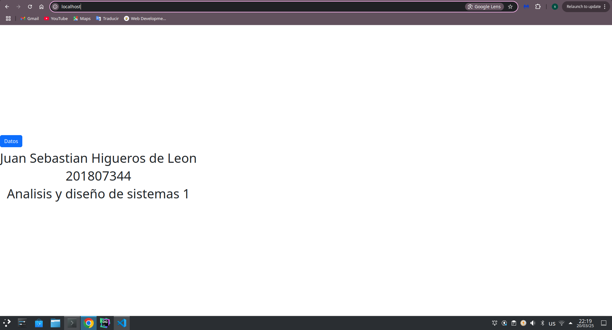
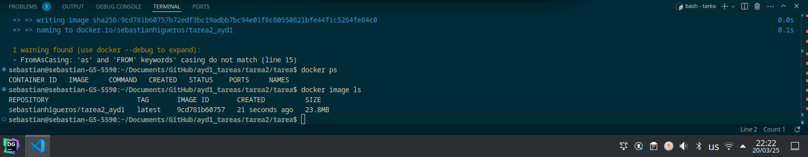
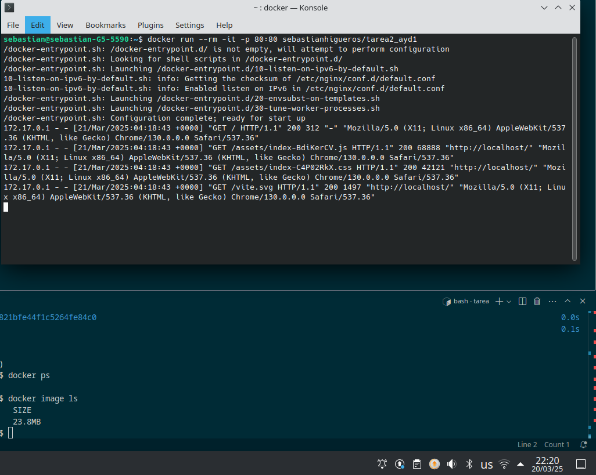
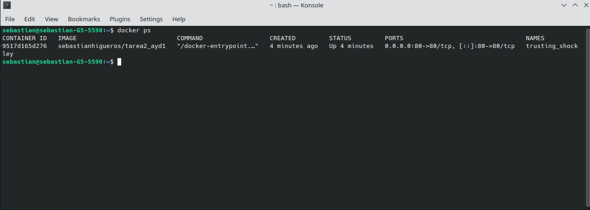

# Tarea 2

En la siguiente imagen se muestra la pagina web corriendo en ambiente local en el puerto 80

En la siguente imagen se puede ver la imagen creada utilizando el dockerfile del proyecto

En la siguiente imagen se puede visualizar el contenedor ejecutandose en el ambiente local

En la ultima imagen se puede visualizar informaciom del contenedor

